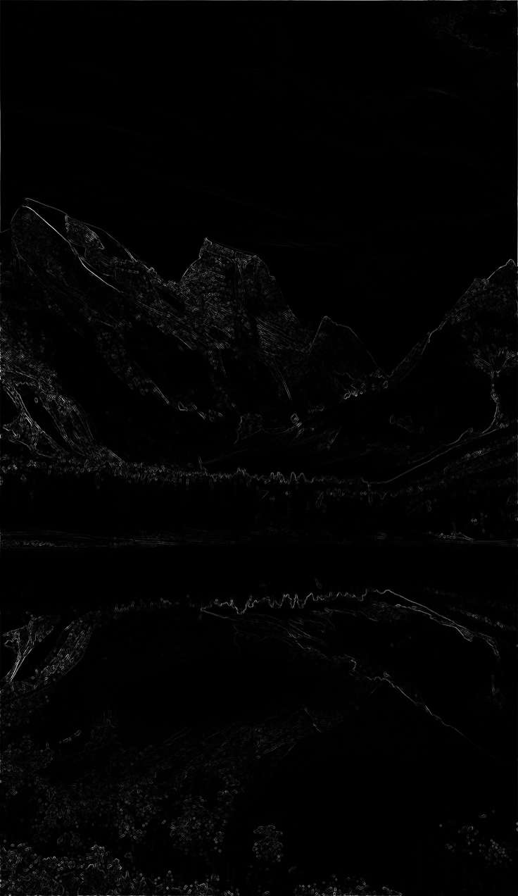

# 📸 Brute-Force Seam Carving  

A **Java-based** implementation of **Seam Carving**, a content-aware image resizing algorithm. This project removes vertical seams with the **lowest energy** to reduce image width while preserving important content.

---

## 🚀 Features  
- 🔹 **Loads an image (`.....png`)** and dynamically reduces its width  
- 🔹 **Computes an energy map** based on pixel gradients  
- 🔹 **Finds and removes seams** with the lowest energy using brute-force search  
- 🔹 **Saves the resized image (`output.jpg`)**  

---

## Screenshots  

### **🔹 Original Image**  


### **🔹 Seam Carved Image**  


### **🔹 Energy Map Visualization**  


---

## 🛠️ Technologies & Libraries  

| Library  | Purpose |
|----------|---------|
| `java.awt.image.BufferedImage`  | Image processing |
| `javax.imageio.ImageIO` | Reading/Writing images |
| `java.io.File` | File handling |

### 🏗️ Built With  
-   

---

## 🎯 How to Run  

### 1️⃣ Clone the repository  
```bash
git clone https://github.com/your-username/seam-carving.git
cd seam-carving
```
### 2️⃣ Compile the Java file 
```bash
javac BruteForceSeamCarving.java
```
### 3️⃣ Run the program
```bash
java BruteForceSeamCarving
```

